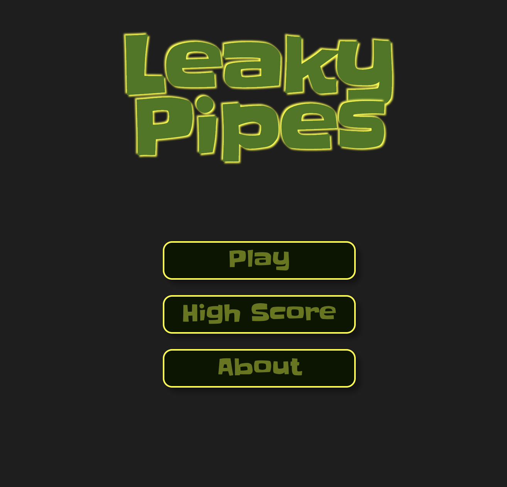

# Leaky pipes
  
Game where you are the plumber and you need to fix leaking pipes.

# Live demo

  - http://leaky-pipes.s3-website.eu-north-1.amazonaws.com/

# Setup

    1. npm install
    2. npm run start
    2. open browser http://localhost:3000

# Known limitations of my solution
  1. Level 5 and 6 does not render
  2. Resizing browser does not rezise canvas
  3. Didn't implement level lock/unlock logic (I ran out of time)
  4. High score page if fictional
  5. No offline support

# Key design decisions made.
  1. Unicode characters replace with spritesheet since had hard time to understand when pipe is connected 
  2. Took game code out of react components.

# PS
  1. I don't write react professionally (just on my free time)
  2. I don't use typescript professionally (just on my free time)
  3. I don't use canvas professionally (not even on my free time)